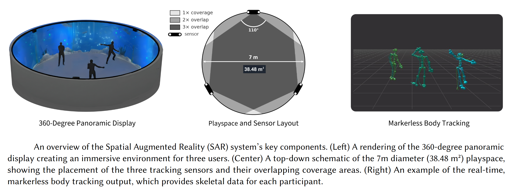

# Template Project for Immersive Spatial Augmented Reality (SAR) System with Body Tracking



This Unity project is a ready-to-use template for developing applications in an **Immersive Spatial Augmented Reality (SAR) System**. It's specifically configured for the 7-meter IglooVision cylinder at Texas A&M University, which uses three ceiling-mounted **ZED 2i cameras**  for robust body tracking. This template provides the foundation for building your own immersive projects that require both panoramic projection and real-time motion tracking.

### Core Features
- **Load Any Environment:** Works as a plug-and-play system. You can easily load your own custom Unity environments, and they will be correctly projected onto the 360° Igloo screen.
- **Multi-User Body Tracking:** Seamlessly tracks the full-body movements of 20+ users simultaneously within the Igloo space.
- **Persistent Tracking IDs:** Each person is assigned a unique ID, allowing for consistent and individualized interactions as long as they remain in the tracked area.
- **Hand Tracking Included:** The system tracks both the right and left hands for every user, enabling intuitive gesture-based interactions.

### Demo Scene: Interactive Music
As a demonstration, we have included an interactive musical experience.

- When a user raises their hand, a virtual bubble is generated from it.
- As the bubble floats and hits the 360° projected wall, it pops and plays a musical note.
- A unique colored water splash effect appears, giving users visual feedback that their
bubble created the sound.

### Get Started

This platform is yours to explore. It's perfect for creating anything from controlled **scientific studies** on human interaction to expressive **artistic installations** that leverage a full field-of-view immersive experience. Clone the repository, load your assets, and start building!

If you use this repository for your project, please see the *"Authorship and Citation Policy"* section at the end of this README for attribution guidelines.

---

## Hardware Overview

### Igloo Cylinder

A 7-meter 360° panoramic projection cylinder by IglooVision.
**More info:** [https://www.igloovision.com/products/cylinders-cubes-domes](images/https://www.igloovision.com/products/cylinders-cubes-domes)

### ZED 2i Cameras

StereoLabs ZED 2i cameras provide real-time depth and body tracking capabilities.
**More info:** [https://www.stereolabs.com/store/products/zed-2i](images/https://www.stereolabs.com/store/products/zed-2i)

---

## Example Demo Overview

The included **demo scene** tracks users' body movements so that **raising hands** triggers **visual splashes** on the cylindrical walls and plays **musical notes** as feedback.
The system supports **multiple users**, with each user’s splashes displayed in a unique color.

---

## Setup Instructions

### 1. Calibrate the ZED System (Optional)

In case you want to re-calibrate the ZED system due to repositioning of the ZED cameras, follow the following steps. This step is optional as if you are using the System at Texas A&M University, then the cameras are already calibrated to work inside the Igloo Cylinder. 

1. Open **ZED360**.
2. Click **Setup your room**.

3. Select **Auto Discover**.

4. Ensure the camera list matches your physical setup (Existing setup has 3 cameras).

5. Click **Setup your room**.

6. Start **Calibration**.

7. Move naturally inside the cylinder to allow cameras to detect body motion. This step may take a while 10-15 minutes.
   * Ensure the room is **well lit** during calibration.
8. Click **Finish Calibration**.

9. Save the resulting **calibration JSON file** in a convenient location. You may use this to run ZED Livelink Fusion as we did in Step 1.


---

### 2. Run Calibrated ZED Fusion

Before running the Unity scene, start the **ZED Unity Livelink Fusion** using your calibration file.

For example, in our system:

```powershell
PS C:\Users\softi> cd C:\Users\softi\Downloads\zedfusion\zed-unity-livelink\zed-unity-livelink-fusion\build\Release
PS C:\Users\softi> ./ZED_Unity_Livelink_Fusion.exe C:\Users\softi\Documents\zed-calibration\zed_calibration.json
```

You should see message saying that all cameras in the system are "Ready", followed by a tracked space where you can see tracked skeletons:


**Detailed setup guide:**
Detailed instructions for setting up zed live link fusion from scratch can be found below. In the current setup, version `v4.2.0` is being used.
[https://github.com/stereolabs/zed-unity-livelink?tab=readme-ov-file#using-the-live-link-for-unity-tools](images/https://github.com/stereolabs/zed-unity-livelink?tab=readme-ov-file#using-the-live-link-for-unity-tools)

---

### 3. Run the Splash Demo Scene

Open and run the **Splash Demo Scene** in Unity.

#### Main Components

* **IglooManager:**
  Configures the Igloo system, projection cameras, and streaming options.
  Supports **Spout** and **NDI** streaming for external projection.

* **FusionManager:**
  Manages body tracking.

  * Contains the port for ZED Fusion stream.
  * Allows switching **tracking mode**, **avatar type**, and **body tracking parameters**.

* **Custom Components:**
  Handle splash spawning and interaction logic based on user movements.

---

### 4. Interaction Behavior

* When users **raise their arms**, splashes appear on the panoramic wall.
* Each user receives a **unique splash color**.
* Musical notes are triggered depending on hand height and horizontal position:

  * Imagine **piano keys laid vertically**, divided into **three horizontal zones** around the cylinder.
  * Higher hand positions trigger higher-pitched notes.

---

### 5. Output & Streaming Options

After running the demo scene, the Unity output can be streamed via **NDI** or **Spout**.

#### Previewing Spout Output

Use the **IglooPreview** tool to preview Spout streams.


#### Streaming via NDI
We currently use NDI to stream from Unity on the host computer to the client computer connected to Igloo System.

1. Open **OBS Studio** on the host computer.
2. Navigate to **Tools → NDI Output Settings**.

3. Enable both **Main Output** and **Preview Output**.


On the **client computer** (connected to the Igloo Projection System):

1. Open **Igloo Core Engine**.
2. Option 1: Choose an existing session (*IPS-1*, configured for the demo implementaiton)


3. Option 2: Create a new session
   * **Session → New Session**
3. Add NDI input:
   * **+ → New Content → Capture → NDI**

4. In the **NDI panel**, select the appropriate stream from the host (for default, select, `VENGEANCE (Unity)`).

5. In the **Geometry** tab to adjust the viewport if necessary.

# Audio
1. Ensure that there is a connection between the host computer and the sound system using a 3.5 mm audio jack (client) and AV cable (sound system).
2. Make sure the sound input is set to **CD** in the sound system (for the main computer, the input is: **CBL/SAT**).
4. (Optional) Open FxSound application, and set up the output method to be the sound system. In the current setup, it is identified by **Realtek HD Audio 2nd output (Realtek(R) Audio)**. FxSound ensures the volume is balanced though all the sounds you may be using in your application, and you can tune.

5. If not using FxSound, ensure proper sound output is selected for the sound system through windows sound output (windows + CTRL + V).


---
You should now be able to step inside Igloo and see it working.
---

## Notes

* The number of users that can be tracked simultaneously depends on the machine’s **computational power**.
* Ensure that **lighting conditions** are optimal for ZED cameras to maintain accurate body tracking.
* Calibration accuracy impacts tracking stability.

---

## Authorship and Citation Policy
This repository is more than a collection of scripts; it is a fully integrated research platform. Its development represents a significant investment of time in software engineering, hardware integration, and calibration, designed to accelerate research by providing a turnkey solution.

In the spirit of scholarly collaboration and to ensure proper acknowledgment of this intellectual contribution, use of this platform is governed by the following policy.

### Tier 1: Citation Requirement (All Uses)
For **any** project, presentation, course syllabus, or internal report that uses or is derived from this work, you are required to cite the following:

- **Project Repository:** [Link to your GitHub repository]
- **Archival Version (DOI):** [Link to your Zenodo/Figshare DOI]

### Tier 2: Co-Authorship Requirement (For Publications)
Co-authorship is required if this platform serves as a **foundational component** of your research leading to a publication (e.g., conference paper, journal article, thesis, or dissertation).

This requirement applies if your work meets one or more of the following criteria:

- Your research methodology relies on the **custom integration of ZED 2i body tracking** within the Unity-based Igloo SAR platform provided by this template.
- Your methodology relies on the platform's custom spatial audio system, which routes audio directly from Unity and bypasses the main projection PC (the computer running the Igloo Engine).
- This software platform serves as the **primary tool** for user interaction or environment rendering in your study/ project. 
- The use of this pre-built platform allowed you to **bypass the significant software development, hardware integration, and calibration effort** required to create a comparable system from scratch.

In these cases, the platform constitutes a significant intellectual contribution that meets the standards for authorship. You are required to contact *Dr. You-Jin Kim* via his **official university email** to discuss his inclusion as a co-author **prior to manuscript submission**.

### A Note on Academic Integrity
This policy is established to uphold the standards of academic and scientific integrity. We have made this work available to advance the field and trust that users will, in turn, properly acknowledge the foundational contributions that make their research possible. Adherence to these guidelines is a matter of professional ethics.


---

## References

* **Igloo Cylinder:** [https://www.igloovision.com/products/cylinders-cubes-domes](https://www.igloovision.com/products/cylinders-cubes-domes)
* **ZED 2i Camera:** [https://www.stereolabs.com/store/products/zed-2i](https://www.stereolabs.com/store/products/zed-2i)
* **ZED SDK (version used: 5.0.0):**: [https://www.stereolabs.com/developers/release](https://www.stereolabs.com/developers/release)
* **ZED Unity Livelink Fusion Setup (version used: 4.2.0):** [https://github.com/stereolabs/zed-unity-livelink](https://github.com/stereolabs/zed-unity-livelink/tree/v4.2.0)
* **Igloo Unity Setup Docs (version used: 1.3):** [https://360igloo.atlassian.net/wiki/spaces/IG/pages/3272867841/v1.3+Installation+Instructions](https://360igloo.atlassian.net/wiki/spaces/IG/pages/3272867841/v1.3+Installation+Instructions)


